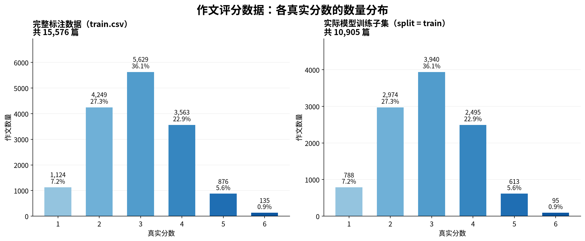
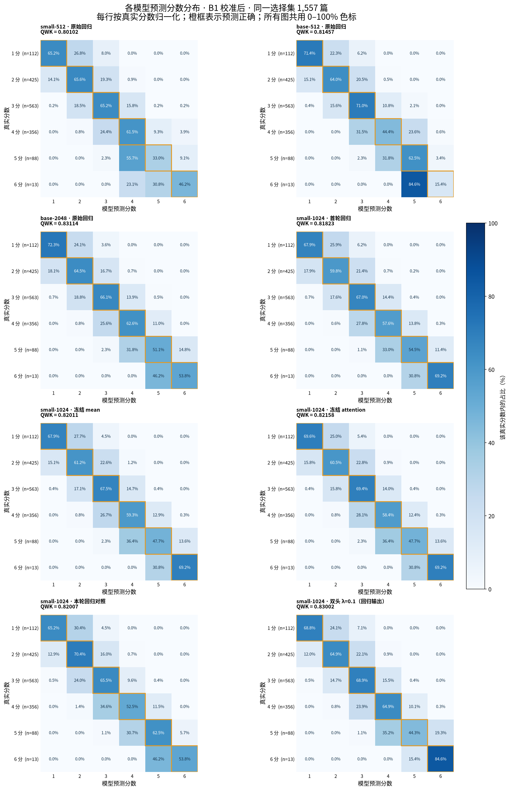
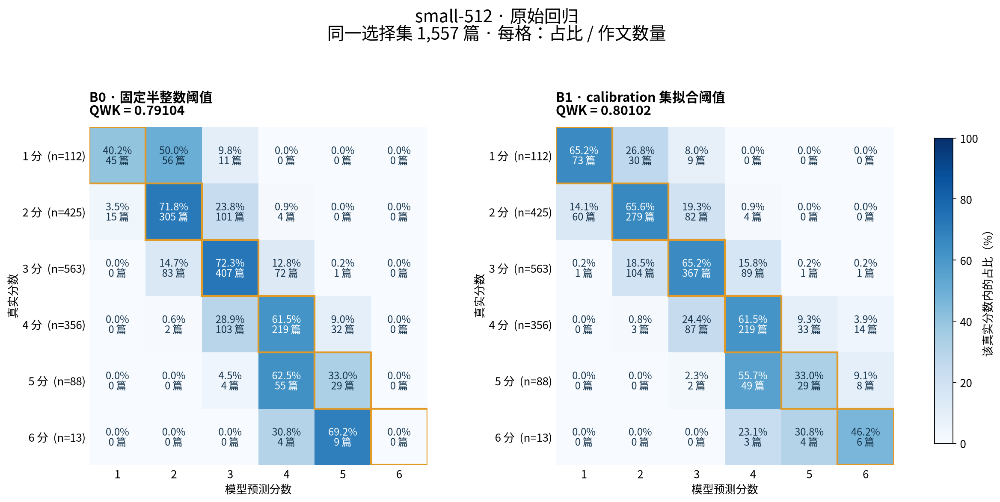
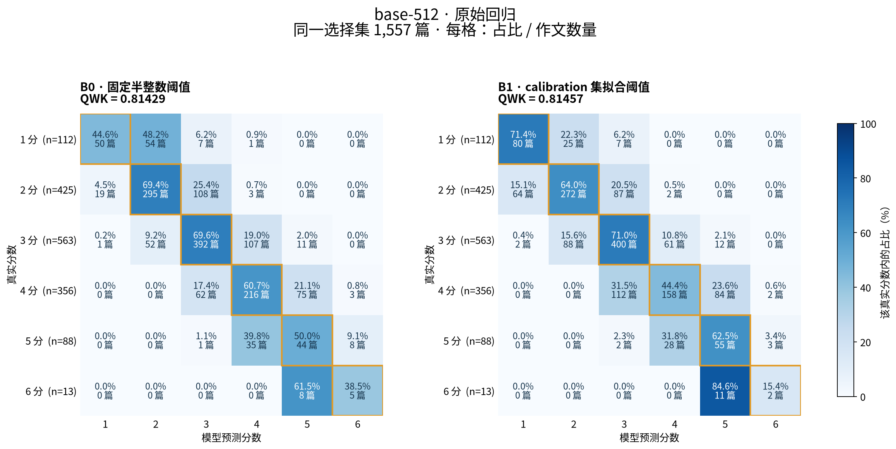
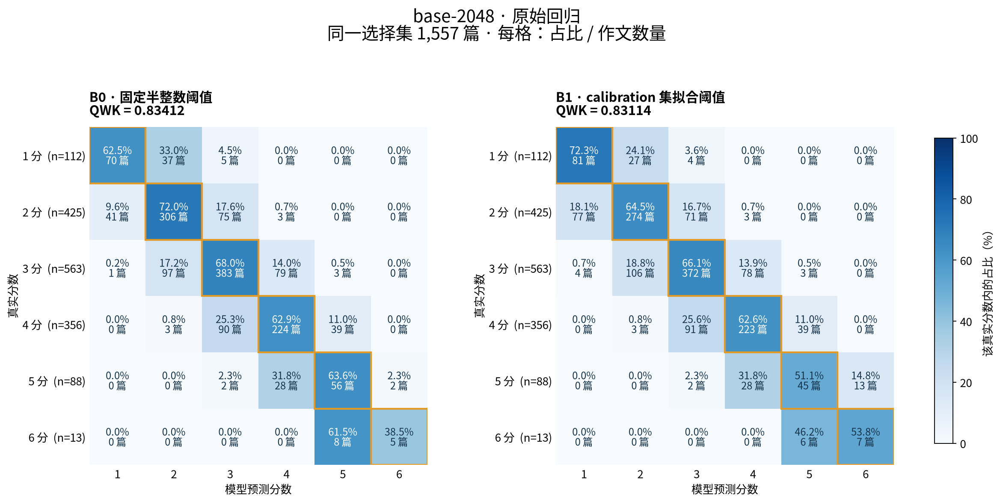
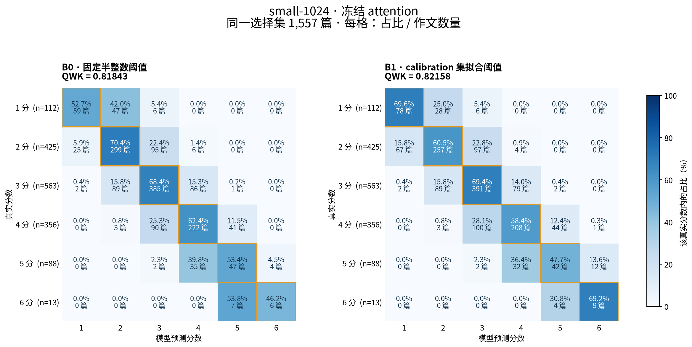
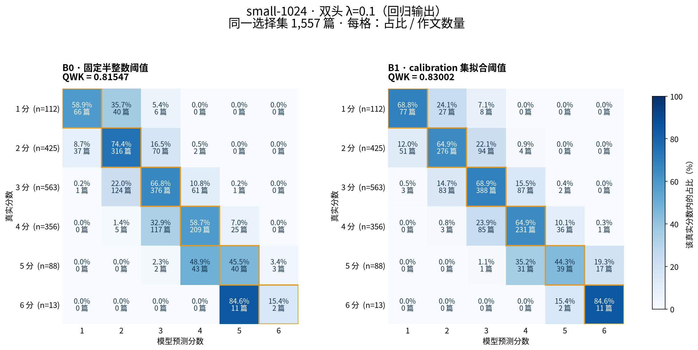

# 作文分数与模型预测分布

主比较使用相同的 1,557 篇 selection 作文；train 图仅用于检查拟合情况，不能代表泛化。

B0 使用固定半整数阈值，B1 使用各自 calibration 集拟合的阈值。双头模型展示回归头输出。

热图每行是一个真实分数，横轴为预测分数。每行合计 100%，单模型图同时标注篇数。橙框是正确预测。

覆盖 8 个已完成的 DeBERTa 相关模型。λ=0.3 尚未完成，因此未纳入；不包含历史 RLT/融合实验。

## 训练数据

## 选择集汇总

[选择集完整 PDF](selection_model_distributions.pdf) · [训练子集完整 PDF](train_model_distributions.pdf)

## 每个模型（左 B0，右 B1）

### small-512 · 原始回归

### base-512 · 原始回归

### base-2048 · 原始回归

### small-1024 · 首轮回归

### small-1024 · 冻结 mean

### small-1024 · 冻结 attention

### small-1024 · 本轮回归对照

### small-1024 · 双头 λ=0.1（回归输出）

原始计数与比例见 `prediction_distribution_cells.csv`；按等级的偏低/偏高比例见 `per_grade_statistics.csv`。
来源、检查点轮次和输入哈希见 `manifest.json`。每个 PNG 同目录均有 SVG 矢量版本。
